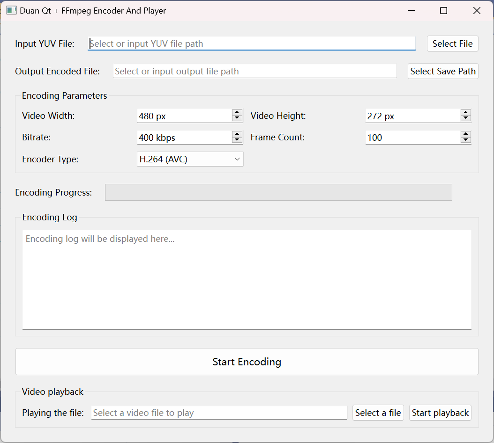

# 效果展示

# 运行方式

## 1.下载FFmpeg预编译库

[BtbN/FFmpeg-Builds](https://github.com/BtbN/FFmpeg-Builds)

## 2.离线安装QT

https://mirrors.ustc.edu.cn/qtproject/archive/qt/

## 3.下载SDL源代码压缩包

[libsdl-org/SDL: Simple DirectMedia Layer](https://github.com/libsdl-org/SDL)

**配置方式可以参考pdf**
